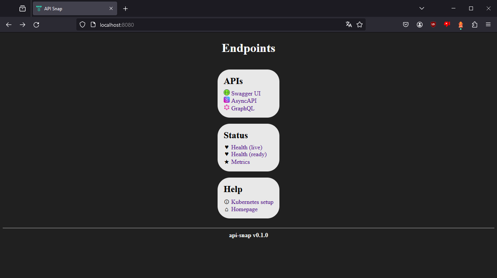
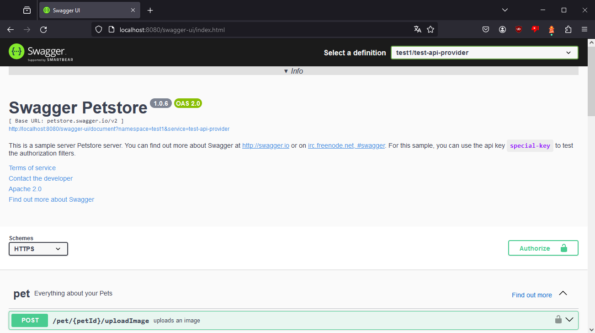
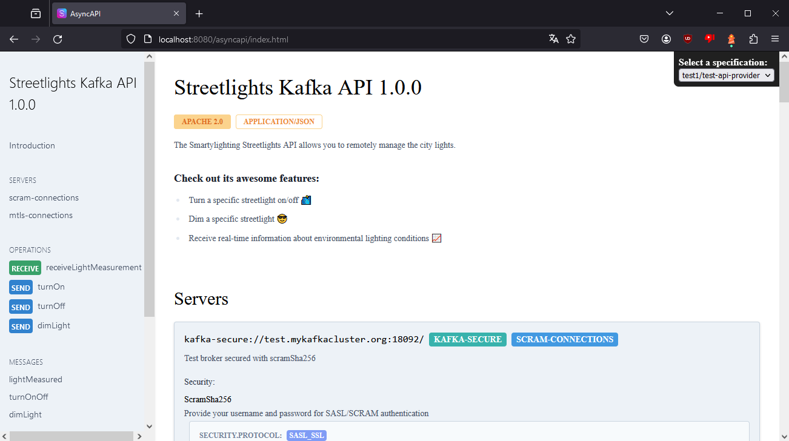
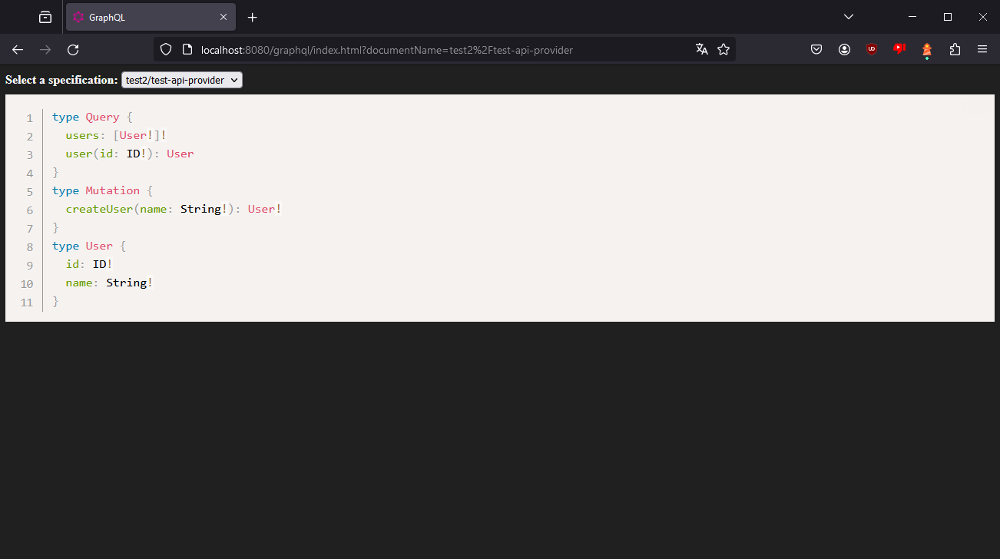

# API Snap

|  | An application which collects API documents by kubernetes service discovery and displays them in a web interface. |
|---|---|

[](https://artifacthub.io/packages/helm/youkadev/api-snap/)
[](https://hub.docker.com/r/youkadev/api-snap)
[](https://github.com/youka/api-snap/tags)  
[](./LICENSE)
[](https://github.com/Youka/api-snap/actions)
[](https://github.com/Youka/api-snap/commits)

**ToC:**
* [Quickstart](#quickstart)
* [Usage](#usage)
  * [User interfaces](#user-interfaces)
  * [Runtime configuration](#runtime-configuration)
  * [Kubernetes setup](#kubernetes-setup)
* [Development](#development)
  * [Tools](#tools)
  * [Commands](#commands)
* [Deployment](#deployment)
* [Troubleshooting](#troubleshooting)
* [Contributung](#contributing)
* [License](#license)
* [Changelog](#changelog)


## Quickstart
_API Snap is mainly used by kubernetes cluster administrators. Experience is expected._  
See [ArtifactHUB](https://artifacthub.io/packages/helm/youkadev/api-snap/) how to add the helm repository and customize chart installations.

For a simple installation just two commands are required:
```sh
helm repo add youkadev https://charts.youka.dev
helm upgrade latest youkadev/api-snap --namespace=api-snap --create-namespace --install --atomic
```

## Usage

### User interfaces
API Snap provides endpoints with graphical user interfaces which are commonly visit by end users. Those are an index listing other endpoints and one page for every supported api.

#### Index
The start page by path `/`.  
Shows an overview what API Snap has to offer.

**Preview:**  


#### Swagger UI
Swagger UI by path `/swagger-ui`.  
Displays found openapi documents (=specifications).

**Preview:**  


#### AsyncAPI
AsyncAPI (React) by path `/asyncapi`.  
Displays found asyncapi documents (=specifications).

**Preview:**  


#### GraphQL
GraphQL (PrismJS) by path `/graphql`.  
Displays found graphql documents (=schemas).

**Preview:**  


### Runtime configuration
Configuring the runtime behaviour of API Snap is possible by **environment variables**.  
Default values are mostly optimal but logging should be set fitting to the deployment environment.

#### Server address
* **Environment variable:** `API_SNAP_ADDRESS`
* **Default value:** `127.0.0.1`
* **Description:** Address of the internal web server to listen. Set to `0.0.0.0` for external access.

#### Server port
* **Environment variable:** `API_SNAP_PORT`
* **Default value:** `8080`
* **Description:** Port of the internal web server to listen. Traffic is always http (unsecured) so ports like `80` or `8080` are recommended values.

#### Client timeout
* **Environment variable:** `API_SNAP_CLIENT_TIMEOUT`
* **Default value:** `30`
* **Description:** Timeout in seconds until a client cancels a connection try. Set a low value so the application threads aren't blocked for long when fetching content but high enough to give slow servers some time.

#### Cache lifespan
* **Environment variable:** `API_SNAP_CACHE_LIFESPAN`
* **Default value:** `10`
* **Description:** Duration in seconds until a cache refreshes. Set a low value so users don't get old content delivered but high enough to reduce client load.

#### Logging
* **Environment variable:** `RUST_LOG`
* **Default value:** _undefined_
* **Description:** Define logging level, target, etc. See [env_logger](https://docs.rs/env_logger/latest/env_logger/).

#### Kubernetes client configuration
* **Environment variable:** `KUBECONFIG`
* **Default value:** _undefined_
* **Description:** Set the path to the kubernetes client configuration file. See [the kubernetes concept](https://kubernetes.io/docs/concepts/configuration/organize-cluster-access-kubeconfig/#the-kubeconfig-environment-variable).

### Kubernetes setup
See [Kubernetes setup](./docs/kubernetes_setup.md) (also available in the application).

## Development
API Snap is a [rust](https://www.rust-lang.org/) project with **web assets** and **kubernetes clusters** as target.  
This document mentions basic tooling and major commands to work with it.

### Tools
* [VSCode](https://code.visualstudio.com/)  
  The recommended IDE (but optional). Also install **recommended plugins**.
* [Rust](https://www.rust-lang.org/tools/install)  
  Install the rust toolchain with **rustup** including the component `clippy`.
* [Docker Desktop](https://www.docker.com/products/docker-desktop/)  
  For containerization and kubernetes install this convenient toolkit.
* [Helm](https://helm.sh/)  
  Install this small tool to apply & package charts for kubernetes deployment.

### Commands

#### Quality Assurance
* Lint code:  
  `cargo clippy`
* Prepare test environment:  
  ```sh
  kubectl apply -f tests/k8s_test_namespaces.yml
  kubectl apply -f tests/k8s_test_resources.yml
  ```
* Run tests:  
  `cargo test`
* Install code coverage tool:  
  `cargo install cargo-tarpaulin`
* Report code coverage:  
  `cargo tarpaulin --out html --output-dir target --engine llvm --skip-clean`
* Render chart templates:  
  `helm template deploy/helm`

#### Build
* Update dependencies:  
  `cargo update`
* Run application:  
  `cargo run`
* Build application (optimized):  
  `cargo build --release --no-default-features --locked`

## Deployment
See [Deployment](./docs/deployment.md).

## Contributing
See [CONTRIBUTING](./CONTRIBUTING.md).

## License
See [LICENSE](./LICENSE).

## Changelog
See [CHANGELOG](./CHANGELOG.md).
